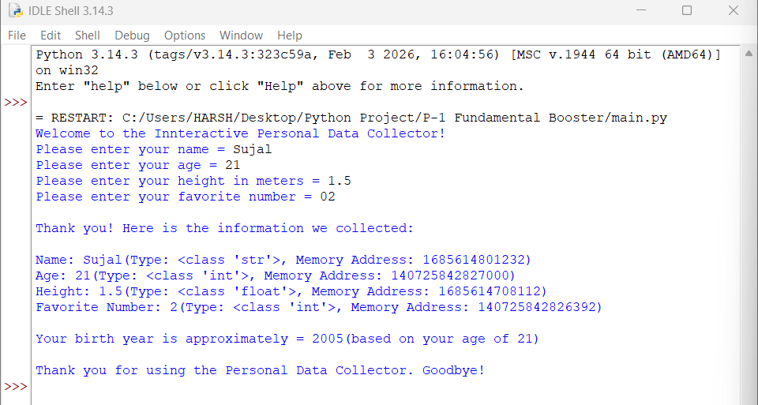

🐍 Interactive Personal Data Collector

P-1 Fundamental Booster

  <strong>A simple Python project for learning user input, data types, type conversion, object identity, and basic calculations.</strong>

  
  
  

🌟 About The Project

Interactive Personal Data Collector is a beginner-friendly Python console project that collects personal information from the user and demonstrates how Python stores and identifies different types of values.

The program collects a name, age, height, and favorite number, then displays the collected information with its Python type and memory address. It also calculates an approximate birth year.

🐍 Python Types Used

<table width="100%">
<thead>
<tr>
<th align="center">#</th>
<th align="left">Data</th>
<th align="center">Python Type</th>
<th align="center">Conversion Used</th>
<th align="center">Example</th>
</tr>
</thead>
<tbody>
<tr>
<td align="center">1</td>
<td>👤 Name</td>
<td align="center"><code>str</code></td>
<td align="center">—</td>
<td align="center"><code>"Sujal"</code></td>
</tr>
<tr>
<td align="center">2</td>
<td>🎂 Age</td>
<td align="center"><code>int</code></td>
<td align="center"><code>int()</code></td>
<td align="center"><code>21</code></td>
</tr>
<tr>
<td align="center">3</td>
<td>📏 Height</td>
<td align="center"><code>float</code></td>
<td align="center"><code>float()</code></td>
<td align="center"><code>1.5</code></td>
</tr>
<tr>
<td align="center">4</td>
<td>🔢 Favorite Number</td>
<td align="center"><code>int</code></td>
<td align="center"><code>int()</code></td>
<td align="center"><code>2</code></td>
</tr>
</tbody>
</table>

💡 The program takes age and favorite number as integers and height as a floating-point value.

🎯 Learning Objectives

<table width="100%">
<thead>
<tr>
<th align="center">#</th>
<th align="left">Python Concept</th>
<th align="left">What You Learn</th>
</tr>
</thead>
<tbody>
<tr><td align="center">1</td><td><code>input()</code></td><td>Take information from the user</td></tr>
<tr><td align="center">2</td><td><code>int()</code></td><td>Convert input into an integer</td></tr>
<tr><td align="center">3</td><td><code>float()</code></td><td>Convert input into a decimal number</td></tr>
<tr><td align="center">4</td><td>Variables</td><td>Store user-provided values</td></tr>
<tr><td align="center">5</td><td><code>type()</code></td><td>Identify the Python data type</td></tr>
<tr><td align="center">6</td><td><code>id()</code></td><td>Display the object's identity</td></tr>
<tr><td align="center">7</td><td>f-strings</td><td>Create formatted output</td></tr>
<tr><td align="center">8</td><td>Arithmetic</td><td>Calculate the approximate birth year</td></tr>
</tbody>
</table>

⚙️ How It Works

1️⃣ Collect User Information

The program asks the user to enter:

Name
Age
Height in meters
Favorite number

2️⃣ Display Data Details

The program displays each value with:

Value → Python Type → Memory Address

3️⃣ Calculate Birth Year

The program uses the year 2026 and calculates:

Birth Year = 2026 - Age

The result is shown as an approximate birth year based on the entered age.

🖥️ Sample Output

Welcome to the Innteractive Personal Data Collector!

Please enter your name = Sujal
Please enter your age = 21
Please enter your height in meters = 1.5
Please enter your favorite number = 02

Thank you! Here is the information we collected:

Name: Sujal
Age: 21
Height: 1.5
Favorite Number: 2

Your birth year is approximately = 2005
(based on your age of 21)

Thank you for using the Personal Data Collector. Goodbye!

⚠️ Note: The memory address returned by id() can be different each time the program runs.

📸 Project Output

🖼️ Console Output Screenshot

 

🔍 Open Full-Size Output Image

🎥 Project Demonstration

▶️ Watch The Project In Action

**▶️ [Open Project Demonstration Video](assets/Project%20Demonstration.mp4)**

 

💡 GitHub Note: If GitHub does not preview the MP4 directly, click the video link to open the video file.

📁 Project Structure

<table>
<tr>
<th>📂 Item</th>
<th>📝 Description</th>
</tr>
<tr>
<td><strong>📄 main.py</strong></td>
<td>Main Python program</td>
</tr>
<tr>
<td><strong>📘 README.md</strong></td>
<td>Project documentation and usage guide</td>
</tr>
<tr>
<td><strong>📂 assets/</strong></td>
<td>Project screenshots and demonstration media</td>
</tr>
<tr>
<td>└── 🖼️ <strong>Output(1).png</strong></td>
<td>Console output screenshot</td>
</tr>
<tr>
<td>└── 🎥 <strong>Project Demonstration(3).mp4</strong></td>
<td>Complete project demonstration video</td>
</tr>
</table>

🗂️ Repository Contents

📄 File

🎯 Purpose

main.py

🐍 Main Python program

README.md

📘 Complete project documentation

assets/Output(1).png

🖼️ Program output screenshot

assets/Project Demonstration(3).mp4

🎥 Project demonstration video

📂 assets/ contains the visual files used to present the project's output and demonstration.

🚀 How To Run

Step 1 — Install Python

Install Python 3.x on your computer.

Step 2 — Open The Project

Open the project in:

IDLE

VS Code

PyCharm

Any Python-supported editor

Step 3 — Run The Program

Using a terminal:

python main.py

Or run main.py directly from your Python IDE.

📦 Dependencies

No external packages are required.

🔄 Program Flow

       👤 USER INPUT
             │
             ▼
    ┌──────────────────┐
    │ Input & Convert  │
    └────────┬─────────┘
             │
             ▼
    ┌──────────────────┐
    │ Store in         │
    │ Variables        │
    └────────┬─────────┘
             │
             ▼
    ┌──────────────────┐
    │ Check Data       │
    │ type() + id()    │
    └────────┬─────────┘
             │
             ▼
    ┌──────────────────┐
    │ Calculate Birth  │
    │ Year             │
    └────────┬─────────┘
             │
             ▼
       🖥️ FINAL OUTPUT

💡 Key Takeaway

Input → Conversion → Storage → Inspection → Calculation → Output

This project combines multiple Python fundamentals into one simple interactive console application and provides practical experience with variables, data types, type conversion, object identity, formatted strings, and arithmetic.

📌 Project Snapshot

<table>
<tr>
<td align="center" width="33%">

🏷️ PROJECT

P-1 Fundamental Booster

</td>
<td align="center" width="33%">

🐍 LANGUAGE

Python 3.x

</td>
<td align="center" width="33%">

📊 LEVEL

Beginner

</td>
</tr>

<tr>
<td align="center" width="33%">

💻 APPLICATION

Console Application

</td>
<td align="center" width="33%">

📦 DEPENDENCIES

None

</td>
<td align="center" width="33%">

📁 RESOURCES

Image + Video

</td>
</tr>
</table>

🎯 Focus: Python fundamentals • User Input • Data Types • Type Conversion • Object Identity • Basic Calculation

⭐ Thanks For Visiting!

Explore • Learn • Code • Improve

Made with 🐍 Python

