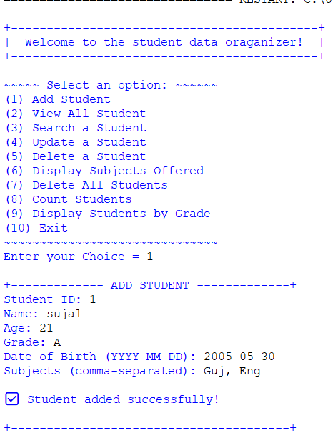
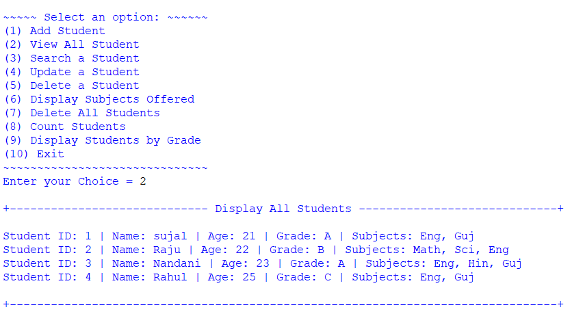
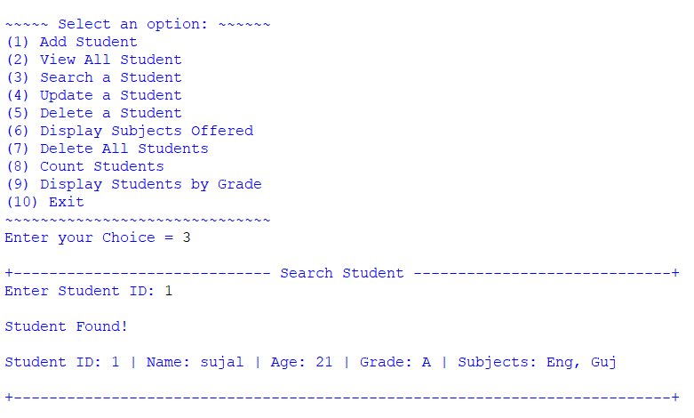
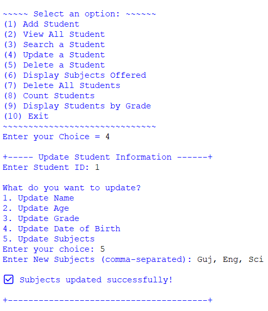
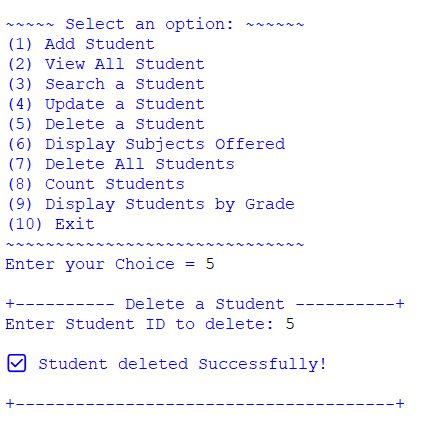
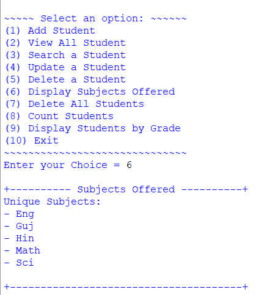
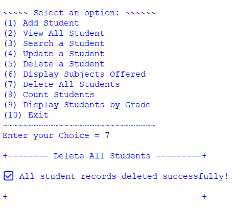
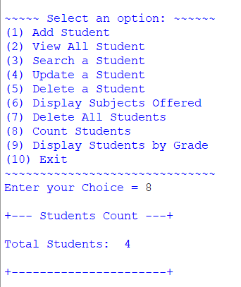
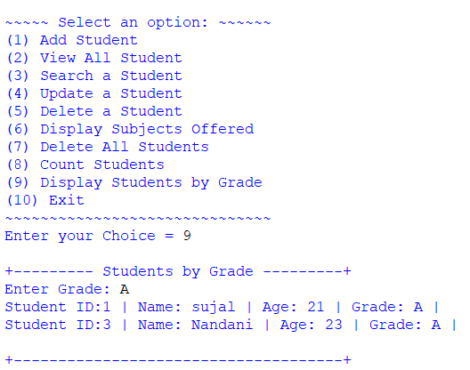
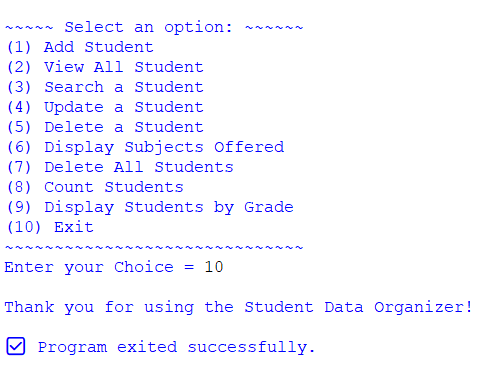

🎓 Student Data Organizer

P-1 • Fundamental Booster

  <strong>A menu-driven Python application for creating, viewing, searching, updating, and managing student records.</strong>

  
  
  
  

🌟 Project Overview

Student Data Organizer is a Python console application built to practice fundamental Python concepts through a practical student-record management system.

The program stores student records in a list and uses dictionaries, tuples, and sets to organize different pieces of information. Users can add students, view records, search by Student ID, update details, delete records, view unique subjects, count students, filter students by grade, and exit the application. fileciteturn2file0L1-L8

🎯 What This Project Can Do

<table width="100%">
<tr>
<td align="center" width="25%">

➕

Add

Create a new student record.

</td>
<td align="center" width="25%">

👀

View

Display all saved students.

</td>
<td align="center" width="25%">

🔎

Search

Find a student by ID.

</td>
<td align="center" width="25%">

✏️

Update

Modify student information.

</td>
</tr>

<tr>
<td align="center">

🗑️

Delete

Remove one student.

</td>
<td align="center">

📚

Subjects

Show unique subjects.

</td>
<td align="center">

🧹

Clear All

Delete every student record.

</td>
<td align="center">

📊

Analyze

Count and filter students.

</td>
</tr>
</table>

🧭 Main Menu

The application provides 10 menu options:

<table width="100%">
<thead>
<tr>
<th align="center">Option</th>
<th align="left">Feature</th>
<th align="left">Purpose</th>
</tr>
</thead>
<tbody>
<tr><td align="center"><code>1</code></td><td>➕ Add Student</td><td>Create and store a student record</td></tr>
<tr><td align="center"><code>2</code></td><td>👀 View All Student</td><td>Display all student records</td></tr>
<tr><td align="center"><code>3</code></td><td>🔎 Search a Student</td><td>Find a student using Student ID</td></tr>
<tr><td align="center"><code>4</code></td><td>✏️ Update a Student</td><td>Change selected student details</td></tr>
<tr><td align="center"><code>5</code></td><td>🗑️ Delete a Student</td><td>Delete one student using Student ID</td></tr>
<tr><td align="center"><code>6</code></td><td>📚 Display Subjects Offered</td><td>Show all unique subjects</td></tr>
<tr><td align="center"><code>7</code></td><td>🧹 Delete All Students</td><td>Clear all student records</td></tr>
<tr><td align="center"><code>8</code></td><td>🔢 Count Students</td><td>Display the total number of students</td></tr>
<tr><td align="center"><code>9</code></td><td>🎓 Display Students by Grade</td><td>Filter students by grade</td></tr>
<tr><td align="center"><code>10</code></td><td>🚪 Exit</td><td>Close the program successfully</td></tr>
</tbody>
</table>

The menu is continuously displayed inside a while loop and the selected option is handled with match case. fileciteturn2file0L6-L13

🧠 Python Concepts Used

<table width="100%">
<thead>
<tr>
<th align="center">#</th>
<th align="left">Concept</th>
<th align="left">How It Is Used</th>
</tr>
</thead>
<tbody>
<tr><td align="center">1</td><td><code>list</code></td><td>Stores all student records</td></tr>
<tr><td align="center">2</td><td><code>dictionary</code></td><td>Stores individual student information</td></tr>
<tr><td align="center">3</td><td><code>tuple</code></td><td>Stores Student ID and Date of Birth together</td></tr>
<tr><td align="center">4</td><td><code>set</code></td><td>Stores subjects without duplicate values</td></tr>
<tr><td align="center">5</td><td><code>while</code> loop</td><td>Keeps the main application running</td></tr>
<tr><td align="center">6</td><td><code>for</code> loop</td><td>Searches and processes student records</td></tr>
<tr><td align="center">7</td><td><code>match case</code></td><td>Controls the menu and update choices</td></tr>
<tr><td align="center">8</td><td><code>if / else</code></td><td>Handles conditions and validation</td></tr>
<tr><td align="center">9</td><td><code>pop()</code></td><td>Removes a selected student from the list</td></tr>
<tr><td align="center">10</td><td><code>clear()</code></td><td>Removes all student records</td></tr>
</tbody>
</table>

📝 Student Record

🎓 What Information Is Stored?

Each student is represented using a combination of
<strong>Dictionary + Tuple + Set</strong>.

📋 Student Information

<table width="100%">
<thead>
<tr>
<th align="center">Field</th>
<th align="center">Example</th>
<th align="left">Stored As</th>
</tr>
</thead>
<tbody>
<tr>
<td align="center">🆔 <strong>Student ID</strong></td>
<td align="center"><code>1</code></td>
<td>Part of the <code>unique_info</code> tuple</td>
</tr>
<tr>
<td align="center">👤 <strong>Name</strong></td>
<td align="center"><code>sujal</code></td>
<td>Dictionary value</td>
</tr>
<tr>
<td align="center">🎂 <strong>Age</strong></td>
<td align="center"><code>21</code></td>
<td>Dictionary value</td>
</tr>
<tr>
<td align="center">🎓 <strong>Grade</strong></td>
<td align="center"><code>A</code></td>
<td>Dictionary value</td>
</tr>
<tr>
<td align="center">📅 <strong>Date of Birth</strong></td>
<td align="center"><code>2005-05-30</code></td>
<td>Part of the <code>unique_info</code> tuple</td>
</tr>
<tr>
<td align="center">📚 <strong>Subjects</strong></td>
<td align="center"><code>Guj, Eng</code></td>
<td><code>set</code> of unique subjects</td>
</tr>
</tbody>
</table>

🧱 Record Structure

Student
   │
   ├── 🆔 unique_info
   │      ├── Student ID
   │      └── Date of Birth
   │
   ├── 👤 name
   ├── 🎂 age
   ├── 🎓 grade
   │
   └── 📚 subjects
          └── Unique Subject Set

🔗 How The Data Is Organized

Python Structure

Role in the Project

📋 List

Stores all student records

📖 Dictionary

Stores one student's complete information

🔗 Tuple

Groups Student ID and Date of Birth

🧩 Set

Stores subjects without duplicate values

When a student is added, the program collects the Student ID, name, age, grade, date of birth, and comma-separated subjects. The subjects are split, cleaned with strip(), and added to a set before the complete student dictionary is appended to the students list. fileciteturn2file0L15-L33

🔧 Feature Details

➕ 01 · Add Student

Creates a complete student record using the entered Student ID, name, age, grade, date of birth, and subjects.

The record is stored as a dictionary and appended to the main students list. fileciteturn2file0L15-L33

👀 02 · View All Students

Displays every student currently stored in the program.

Each record shows:

Student ID → Name → Age → Grade → Subjects

If there are no records, the program displays a message indicating that no student records were found. fileciteturn2file0L36-L45

🔎 03 · Search a Student

Enter a Student ID to search the stored records.

If the ID exists, the program displays the matching student. Otherwise, it reports that the student was not found. fileciteturn2file0L47-L59

✏️ 04 · Update Student

🔎 Find → ✏️ Edit → ✅ Save

Enter the Student ID of the record you want to modify. Once the student is found, choose which information you want to update.

<table width="100%">
<thead>
<tr>
<th align="center">Choice</th>
<th align="left">Field</th>
<th align="left">Action</th>
</tr>
</thead>
<tbody>
<tr>
<td align="center"><code>1</code></td>
<td>👤 Name</td>
<td>Replace the student's name</td>
</tr>
<tr>
<td align="center"><code>2</code></td>
<td>🎂 Age</td>
<td>Update the student's age</td>
</tr>
<tr>
<td align="center"><code>3</code></td>
<td>🎓 Grade</td>
<td>Change the student's grade</td>
</tr>
<tr>
<td align="center"><code>4</code></td>
<td>📅 Date of Birth</td>
<td>Update the date of birth</td>
</tr>
<tr>
<td align="center"><code>5</code></td>
<td>📚 Subjects</td>
<td>Replace the subject set</td>
</tr>
</tbody>
</table>

💡 Update Flow

Student ID
    ↓
Find Student
    ↓
Choose Field
    ↓
Enter New Value
    ↓
✅ Updated Successfully

The Student ID remains the same while the selected field is updated. The program supports updating the name, age, grade, date of birth, or subjects. fileciteturn2file0L60-L107

🔢 08 · Student Count

📊 Quick Record Summary

This option gives a quick count of how many student records are currently stored.

<table width="70%">
<tr>
<td align="center">

👥 Total Students

4

</td>
</tr>
</table>

The program calculates the count using:

len(students)

🖥️ Example Output

+--- Students Count ---+

Total Students: 4

+----------------------+

This value changes automatically as student records are added or deleted. fileciteturn2file0L145-L148

🎓 09 · Display Students by Grade

Enter a grade such as A to display students whose grade matches the entered value.

The program checks each student record and displays matching students. fileciteturn2file0L149-L160

🚪 10 · Exit

Selecting option 10 displays a goodbye message and exits the main loop.

Thank you for using the Student Data Organizer!

✅ Program exited successfully.

fileciteturn2file0L161-L164

📸 Output Gallery

🖥️ Complete Program Demonstration Screenshots

<table width="100%">
<tr>
<td width="50%" valign="top" align="center">

➕ Add Student

🔍 View Full Image

</td>
<td width="50%" valign="top" align="center">

👀 View All Students

🔍 View Full Image

</td>
</tr>

<tr>
<td width="50%" valign="top" align="center">

🔎 Search Student

🔍 View Full Image

</td>
<td width="50%" valign="top" align="center">

✏️ Update Student

🔍 View Full Image

</td>
</tr>

<tr>
<td width="50%" valign="top" align="center">

🗑️ Delete Student

🔍 View Full Image

</td>
<td width="50%" valign="top" align="center">

📚 Subjects Offered

🔍 View Full Image

</td>
</tr>

<tr>
<td width="50%" valign="top" align="center">

🧹 Delete All Students

🔍 View Full Image

</td>
<td width="50%" valign="top" align="center">

🔢 Students Count

🔍 View Full Image

</td>
</tr>

<tr>
<td width="50%" valign="top" align="center">

🎓 Students by Grade

🔍 View Full Image

</td>
<td width="50%" valign="top" align="center">

🚪 Program Exit

🔍 View Full Image

</td>
</tr>
</table>

🎥 Project Demonstration

▶️ Watch the Complete Project

<a href="assets/Project%20Demonstration%285%29.mp4">

<strong>▶️ OPEN PROJECT DEMONSTRATION VIDEO</strong>

</a>

  

Demonstrates student creation, viewing, searching, updating, deleting,
subject management, counting, grade filtering, and program exit.

💡 GitHub Tip: If the MP4 does not preview directly in GitHub, click the video link above to open the file.

🔄 Application Flow

                 🎓 START
                    │
                    ▼
             ┌──────────────┐
             │  MAIN MENU   │
             └──────┬───────┘
                    │
       ┌────────────┼────────────┐
       ▼            ▼            ▼
   👨‍🎓 STUDENT    📚 DATA      🚪 EXIT
   MANAGEMENT     TOOLS
       │            │
       ▼            ▼
  Add / View /   Subjects /
  Search /       Count /
  Update /       Grade
  Delete         Filter
       │            │
       └──────┬─────┘
              ▼
        🔁 MAIN MENU

🗂️ Project Resources

<table width="100%">
<thead>
<tr>
<th align="left">📄 Resource</th>
<th align="left">🎯 Purpose</th>
</tr>
</thead>
<tbody>
<tr><td><code>main.py</code></td><td>Main Python source code</td></tr>
<tr><td><code>README.md</code></td><td>Project documentation</td></tr>
<tr><td><code>assets/Output1.png</code> → <code>Output10.png</code></td><td>Program output screenshots</td></tr>
<tr><td><code>assets/Project Demonstration(5).mp4</code></td><td>Complete project demonstration</td></tr>
</tbody>
</table>

🚀 How To Run

1️⃣ Open the project

Open main.py in IDLE, VS Code, PyCharm, or another Python-supported editor.

2️⃣ Run the program

python main.py

3️⃣ Choose an option

(1) Add Student
(2) View All Student
(3) Search a Student
(4) Update a Student
(5) Delete a Student
(6) Display Subjects Offered
(7) Delete All Students
(8) Count Students
(9) Display Students by Grade
(10) Exit

📦 Dependencies

No external Python packages are required.

🧪 Concepts Practiced

Lists · Dictionaries · Tuples · Sets · while · for · match case · if/else · len() · pop() · clear() · input()

🏁 Final Takeaway

Store → Organize → Search → Update → Analyze → Manage

This project brings together multiple Python collection types and control-flow concepts in one practical Student Data Organizer.

⭐ Learn Python by building real programs.

 

Made with 🐍 Python

