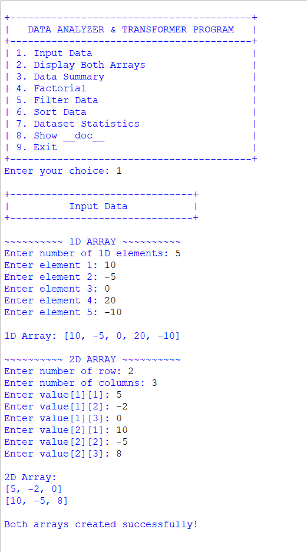
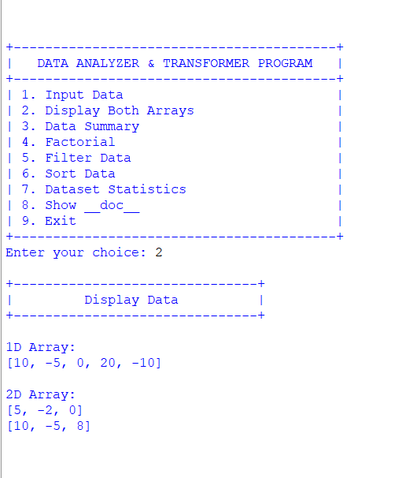
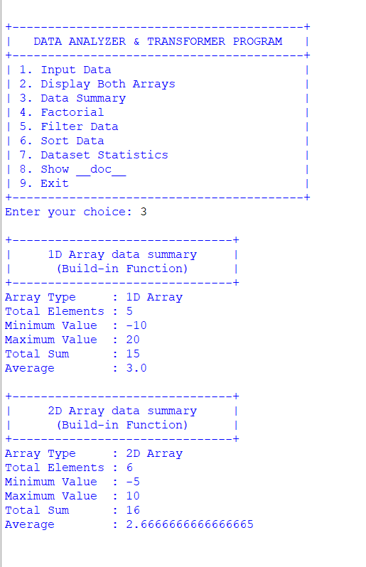
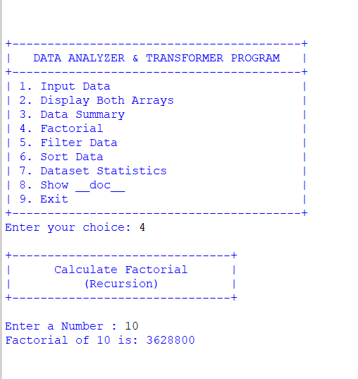
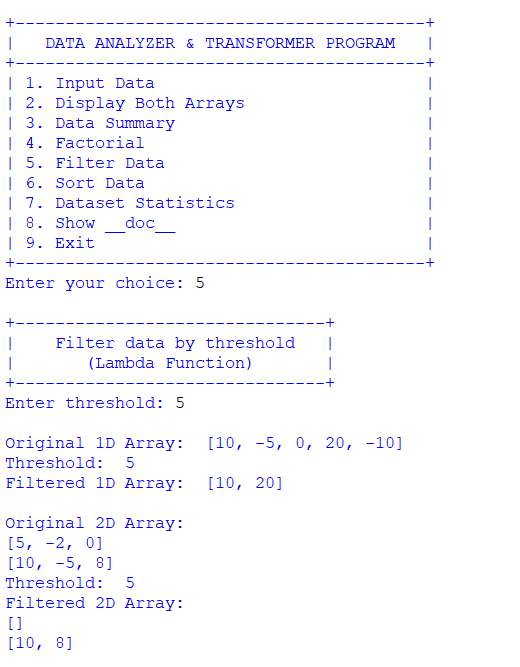
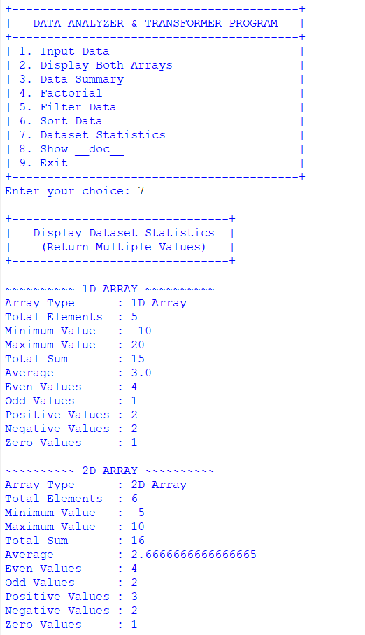
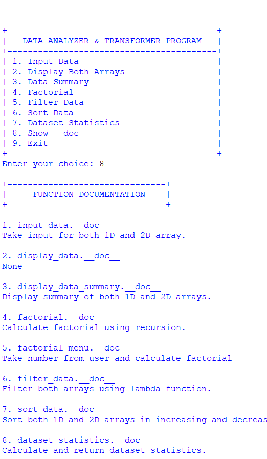
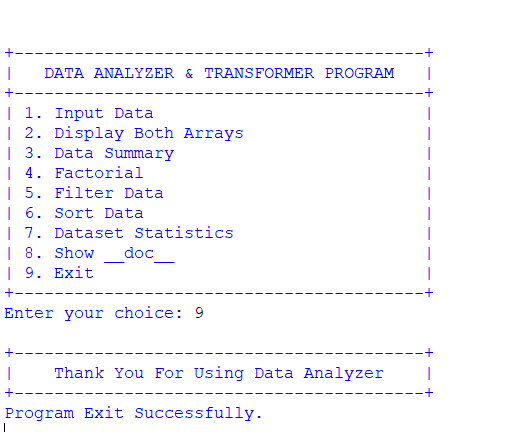

<div align="center">

# 📊 Data Analyzer & Transformer

### **Python Array Processing & Analysis Tool**

<p>
  A menu-driven Python application for creating, transforming, sorting, filtering, and analyzing both <strong>1D and 2D arrays</strong>.
</p>

<br>


<br><br>

**Input → Transform → Analyze → Display**

</div>

---

# 📌 Project Overview

**Data Analyzer & Transformer** is a Python console-based application created to practice and demonstrate different programming concepts through practical array operations.

The program works with **both 1D and 2D integer arrays** and provides a central menu from which users can perform different operations.

The application creates both arrays through a single input function and then uses the same datasets throughout the available analysis and transformation features.

### What This Project Can Do

```text
┌──────────────────────────────────────────────┐
│          DATA ANALYZER & TRANSFORMER         │
├──────────────────────────────────────────────┤
│                                              │
│  01  Create 1D + 2D Arrays                   │
│  02  Display Arrays                          │
│  03  Generate Data Summary                   │
│  04  Calculate Factorial                     │
│  05  Filter Values                           │
│  06  Sort Values                             │
│  07  Analyze Dataset Statistics              │
│  08  View Function Documentation             │
│  09  Exit                                    │
│                                              │
└──────────────────────────────────────────────┘
```

The main menu provides these nine operations.

---

# 🧭 Application Map

<div align="center">

| Module | Purpose | Main Concept |
|:---:|:---|:---|
| `01` | Input Data | Lists + Nested Lists |
| `02` | Display Data | Loops |
| `03` | Data Summary | Built-in Functions |
| `04` | Factorial | Recursion |
| `05` | Filter Data | Lambda + `filter()` |
| `06` | Sort Data | `sorted()` |
| `07` | Dataset Statistics | Loops + Conditions |
| `08` | Function Documentation | `__doc__` |
| `09` | Exit | Program Control |

</div>

---

# 🖥️ Main Interface

The application starts with the following menu:

```text
+-----------------------------------------+
|   DATA ANALYZER & TRANSFORMER PROGRAM   |
+-----------------------------------------+
| 1. Input Data                           |
| 2. Display Both Arrays                  |
| 3. Data Summary                         |
| 4. Factorial                            |
| 5. Filter Data                          |
| 6. Sort Data                            |
| 7. Dataset Statistics                   |
| 8. Show __doc__                         |
| 9. Exit                                 |
+-----------------------------------------+

Enter your choice:
```

The menu runs continuously using a `while True` loop until the user selects option `9`.

---

# 01 — 📥 Input Data

The first option creates **both arrays**.

## 1D Array

The user enters the number of elements and then provides each value individually.

```text
~~~~~~~~~~ 1D ARRAY ~~~~~~~~~~

Enter number of 1D elements: 5
Enter element 1: 10
Enter element 2: 25
Enter element 3: 5
Enter element 4: 40
Enter element 5: 15

1D Array: [10, 25, 5, 40, 15]
```

## 2D Array

The user specifies the number of rows and columns and enters every value.

```text
~~~~~~~~~~ 2D ARRAY ~~~~~~~~~~

Enter number of row: 2
Enter number of columns: 3

Enter value[1][1]: 10
Enter value[1][2]: 20
Enter value[1][3]: 30
Enter value[2][1]: 40
Enter value[2][2]: 50
Enter value[2][3]: 60

2D Array:
[10, 20, 30]
[40, 50, 60]

Both arrays created successfully!
```

---

# 02 — 👀 Display Both Arrays

Option `2` displays the currently stored 1D and 2D arrays.

The 1D array is printed directly, while each row of the 2D array is displayed using a loop.

```text
+-------------------------------+
|         Display Data          |
+-------------------------------+

1D Array:
[10, 25, 5, 40, 15]

2D Array:
[10, 20, 30]
[40, 50, 60]
```

If arrays have not been created, the program asks the user to enter both arrays first.

---

# 03 — 📋 Data Summary

Option `3` calculates a basic summary for both arrays.

### 1D Summary

```text
+-------------------------------+
|     1D Array data summary     |
|      (Build-in Function)      |
+-------------------------------+

Array Type     : 1D Array
Total Elements : 5
Minimum Value  : 5
Maximum Value  : 40
Total Sum      : 95
Average        : 19.0
```

### 2D Summary

```text
+-------------------------------+
|     2D Array data summary     |
|      (Build-in Function)      |
+-------------------------------+

Array Type     : 2D Array
Total Elements : 6
Minimum Value  : 10
Maximum Value  : 60
Total Sum      : 210
Average        : 35.0
```

The implementation calculates count, minimum, maximum, sum, and average for both arrays.

---

# 04 — 🔢 Factorial

The factorial feature demonstrates **recursion**.

The program uses:

```python
def factorial(n):
    if n <= 1:
        return 1
    return n * factorial(n - 1)
```

The factorial menu accepts a number from the user and calculates the result recursively.

### Example

```text
+-------------------------------+
|      Calculate Factorial      |
|          (Recursion)          |
+-------------------------------+

Enter a Number : 5

Factorial of 5 is: 120
```

### Calculation

```text
5! = 5 × 4 × 3 × 2 × 1

5! = 120
```

---

# 05 — 🔎 Filter Data

Option `5` filters values greater than a user-defined threshold.

This section demonstrates:

- Lambda functions
- `filter()`
- Lists
- Nested loops

The filtering condition is:

```python
lambda x: x > threshold
```

The function applies the filter separately to the 1D array and every row of the 2D array.

### Example

```text
Enter threshold: 20

Original 1D Array:
[10, 25, 5, 40, 15]

Threshold:
20

Filtered 1D Array:
[25, 40]
```

For a 2D dataset:

```text
Original 2D Array:
[10, 20, 30]
[40, 50, 60]

Filtered 2D Array:
[30]
[40, 50, 60]
```

---

# 06 — ↕️ Sort Data

Option `6` provides a separate sorting menu:

```text
+-------------------------------+
|           Sort Data           |
|   (Increasing / Decreasing)   |
+-------------------------------+

1. Ascending
2. Descending
3. Exit
```

The program supports both ascending and descending sorting.

## Ascending

The 1D array is sorted using Python's `sorted()` function.

For the 2D array, values are first collected into a temporary list, sorted, and then reconstructed into the original row/column structure.

```text
Original:
[10, 25, 5, 40, 15]

Ascending:
[5, 10, 15, 25, 40]
```

## Descending

The same general process is used for the 2D data in the descending branch.

---

# 07 — 📊 Dataset Statistics

Option `7` provides detailed statistics for both arrays.

The program calculates:

```text
Total Elements
Minimum Value
Maximum Value
Total Sum
Average
Even Values
Odd Values
Positive Values
Negative Values
Zero Values
```

The statistics are calculated separately for the 1D and 2D arrays.

### Example

```text
~~~~~~~~~~ 1D ARRAY ~~~~~~~~~~

Array Type      : 1D Array
Total Elements  : 5
Minimum Value   : 5
Maximum Value   : 40
Total Sum       : 95
Average         : 19.0
Even Values     : 2
Odd Values      : 3
Positive Values : 5
Negative Values : 0
Zero Values     : 0
```

The same statistics are displayed for the 2D array.

---

# 08 — 📖 Function Documentation

Option `8` demonstrates Python's `__doc__` attribute.

The program displays documentation strings belonging to its functions.

The documentation menu includes:

```text
1. input_data.__doc__
2. display_data.__doc__
3. display_data_summary.__doc__
4. factorial.__doc__
5. factorial_menu.__doc__
6. filter_data.__doc__
7. sort_data.__doc__
8. dataset_statistics.__doc__
9. show_doc.__doc__
```

Example:

```text
+-------------------------------+
|     FUNCTION DOCUMENTATION    |
+-------------------------------+

1. input_data.__doc__
Take input for both 1D and 2D array.

4. factorial.__doc__
Calculate factorial using recursion.
```

---

# 09 — 🚪 Exit

Selecting option `9` terminates the program:

```text
+-----------------------------------------+
|    Thank You For Using Data Analyzer    |
+-----------------------------------------+
Program Exit Successfully.
```

The exit branch breaks the main loop.

---

# 🧩 Function Overview

The project is divided into multiple functions:

| Function | Responsibility |
|:---|:---|
| `input_data()` | Creates 1D and 2D arrays |
| `display_data()` | Displays both arrays |
| `display_data_summary()` | Calculates basic array summaries |
| `factorial()` | Calculates factorial recursively |
| `factorial_menu()` | Handles factorial input/output |
| `filter_data()` | Filters values using lambda |
| `sort_data()` | Sorts 1D and 2D arrays |
| `dataset_statistics()` | Calculates detailed statistics |
| `display_statistics()` | Displays returned statistics |
| `show_doc()` | Displays function documentation |

These functions are defined in the supplied program.

---

# 🧠 Python Concepts Demonstrated

| Concept | Application |
|:---|:---|
| Variables | Store arrays and calculated values |
| Lists | Store 1D data |
| Nested Lists | Represent 2D data |
| Functions | Divide the program into reusable sections |
| Parameters | Pass arrays between functions |
| Return Values | Return arrays and statistics |
| Multiple Return Values | Return 1D and 2D statistics together |
| Built-in Functions | `sum()`, `len()`, `min()`, `max()` |
| `for` Loop | Traverse arrays |
| Nested Loops | Process 2D arrays |
| `while` Loop | Run the menu continuously |
| `if / elif / else` | Control decisions |
| Recursion | Factorial calculation |
| Lambda | Filtering values |
| `filter()` | Threshold-based filtering |
| `sorted()` | Sorting data |
| Tuple | Store calculated statistics |
| Docstrings | Document functions |
| `__doc__` | Display documentation |

---

# 🗃️ Data Representation

## 1D Array

```python
array_1d = [10, 25, 5, 40, 15]
```

## 2D Array

```python
array_2d = [
    [10, 20, 30],
    [40, 50, 60]
]
```

The input function returns both datasets:

```python
return array_1d, array_2d
```

This allows the main program to keep both arrays available for later operations.

---

# 🔬 Statistics Pipeline

```text
                 INPUT DATA
                     │
                     ▼
              ┌─────────────┐
              │  1D + 2D    │
              │   Arrays    │
              └──────┬──────┘
                     │
          ┌──────────┼──────────┐
          ▼          ▼          ▼
       Summary     Filter      Sort
          │          │          │
          └──────────┼──────────┘
                     ▼
              Detailed Stats
                     │
                     ▼
          ┌─────────────────────┐
          │ Count               │
          │ Min / Max           │
          │ Sum / Average       │
          │ Even / Odd          │
          │ Positive / Negative │
          │ Zero                │
          └──────────┬──────────┘
                     │
                     ▼
                FINAL OUTPUT
```

The statistics function returns separate tuples for the 1D and 2D datasets.

---

# 📂 Project Structure

```text
📦 Data-Analyzer-and-Transformer
│
├── 🐍 main.py
├── 📘 README.md
│
└── 📂 assets
    ├── 🖼️ Output1.png
    ├── 🖼️ Output2.png
    ├── 🖼️ Output3.png
    ├── 🖼️ Output4.png
    ├── 🖼️ Output5.png
    ├── 🖼️ Output6.png
    ├── 🖼️ Output7.png
    ├── 🖼️ Output8.png
    ├── 🖼️ Output9.png
    └── 🎥 Project Demonstration.mp4
```

---

# 🖼️ Output Gallery

<div align="center">

## 1️⃣ Input Data



<br><br>

## 2️⃣ Display Both Arrays



<br><br>

## 3️⃣ Data Summary



<br><br>

## 4️⃣ Factorial



<br><br>

## 5️⃣ Filter Data



<br><br>

## 6️⃣ Sort Data


<br><br>

## 7️⃣ Dataset Statistics



<br><br>

## 8️⃣ Function Documentation



<br><br>

## 9️⃣ Exit



</div>

---

# 🎥 Project Demonstration

<div align="center">

## ▶️ See The Complete Project In Action

The demonstration video covers the complete workflow of the application:

```text
01  ▶ Create 1D & 2D Arrays
02  ▶ Display Both Arrays
03  ▶ Generate Data Summary
04  ▶ Calculate Factorial
05  ▶ Filter Values
06  ▶ Sort Arrays
07  ▶ Display Dataset Statistics
08  ▶ Show Function Documentation
09  ▶ Exit The Application
```

<br>

### 🎬 Watch The Demonstration

**[▶️ Open Project Demonstration Video](assets/Project%20Demonstration.mp4)**

<br>

</div>

> [!TIP]
> If GitHub does not preview the MP4 directly, click the demonstration link above to open the video file.

### 🎥 Demonstration File

```text
assets/
└── Project Demonstration.mp4
```

---

# 🚀 How To Run

## Step 1 — Install Python

Install Python 3.x on your computer.

Verify the installation:

```bash
python --version
```

---

## Step 2 — Open The Project

Open the project folder using any Python-supported editor:

```text
VS Code
PyCharm
IDLE
Any Python IDE
```

---

## Step 3 — Open Terminal

Navigate to the project directory:

```bash
cd Data-Analyzer-and-Transformer
```

---

## Step 4 — Run The Program

```bash
python main.py
```

---

## Step 5 — Select A Menu Option

The application will display:

```text
1. Input Data
2. Display Both Arrays
3. Data Summary
4. Factorial
5. Filter Data
6. Sort Data
7. Dataset Statistics
8. Show __doc__
9. Exit
```

---

# 📦 Requirements

The project requires:

```text
🐍 Python 3.x
```

No external Python packages are required.

```text
External Libraries → None
Database → None
API → None
Framework → None
```

---

# ⚠️ Program Notes

### Arrays Must Be Created First

Options `2`, `3`, `5`, `6`, and `7` require both arrays to be available.

If no arrays have been entered:

```text
Please enter both arrays first.
```

This validation is implemented in the main menu.

### Factorial Works Independently

The factorial option can be used without creating the arrays first.

### Documentation Works Independently

The `__doc__` option can also be selected without entering array data.

---

# 🎯 Learning Outcomes

This project provides practical experience with:

```text
✓ 1D Arrays
✓ 2D Arrays
✓ Lists
✓ Nested Lists
✓ Functions
✓ Function Parameters
✓ Return Values
✓ Multiple Return Values
✓ Built-in Functions
✓ Lambda Functions
✓ filter()
✓ sorted()
✓ Recursion
✓ Tuples
✓ Loops
✓ Conditional Statements
✓ Docstrings
✓ __doc__
✓ Menu-Driven Programs
```

---

# 🚧 Future Improvements

Possible extensions for future versions:

- [ ] Search for a particular value
- [ ] Find duplicate values
- [ ] Add median calculation
- [ ] Add mode calculation
- [ ] Add standard deviation
- [ ] Add matrix addition
- [ ] Add matrix subtraction
- [ ] Add matrix multiplication
- [ ] Add matrix transpose
- [ ] Add input validation
- [ ] Add exception handling
- [ ] Save arrays to a file
- [ ] Export statistics
- [ ] Add graphical data visualization
- [ ] Add a GUI version

---

# 📊 Project Snapshot

<div align="center">

<table width="100%">

<tr>

<td align="center" width="33%">

### 🏷️ PROJECT

**Data Analyzer & Transformer**

</td>

<td align="center" width="33%">

### 🐍 LANGUAGE

**Python 3.x**

</td>

<td align="center" width="33%">

### 💻 TYPE

**Console Application**

</td>

</tr>

<tr>

<td align="center">

### 🔢 DATA

**1D + 2D Arrays**

</td>

<td align="center">

### 🧠 CONCEPTS

**Python Fundamentals**

</td>

<td align="center">

### 📦 PACKAGES

**None**

</td>

</tr>

<tr>

<td align="center">

### 🔧 FUNCTIONS

**Modular Design**

</td>

<td align="center">

### 📊 ANALYSIS

**Statistics**

</td>

<td align="center">

### 🎥 DEMO

**Video Included**

</td>

</tr>

</table>

</div>

---

# 🧑‍💻 Author

<div align="center">

## **Sujal Patel**

### Python Developer / Learner

**Python • Data Structures • Functions • Problem Solving**

<br>

This project was developed as a practical implementation of Python programming fundamentals, array processing, transformation techniques, recursion, filtering, sorting, and dataset analysis.

</div>

---

# 📄 License

This project is created for **educational and learning purposes**.

---

<div align="center">

# 📊 Data Analyzer & Transformer

### **Create • Analyze • Transform • Understand**

<br>

🐍 **Developed by Sujal Patel**

<br>

**Thank you for visiting this project!**

<br>

⭐ **Explore • Learn • Code • Improve**

<br><br>

<a href="#-data-analyzer--transformer">⬆ Back to Top</a>

</div>